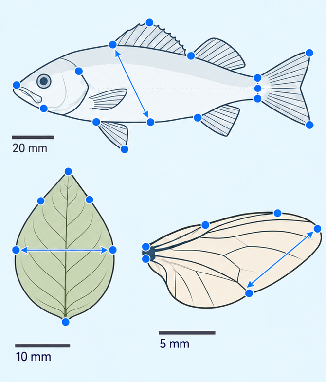
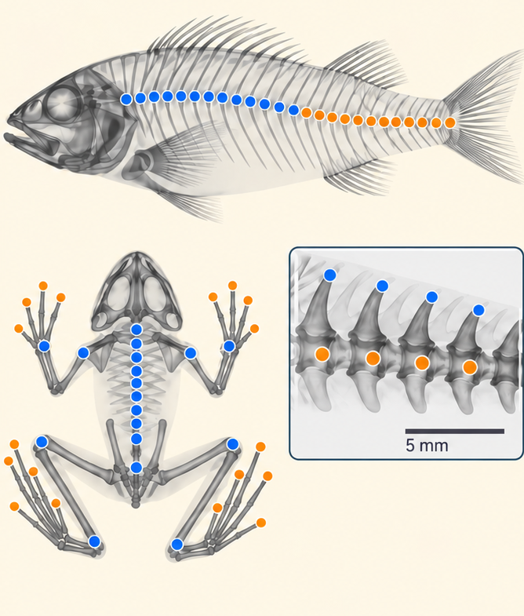

# MorphoLabel

**Open-source software for scalable and reproducible extraction of morphological data from biological images.**

MorphoLabel is designed for research projects in which large image collections must be converted into structured morphological data without losing the connection between the original image, the human decision, the AI model and the final exported result.

The central idea is **human-in-the-loop mass annotation**: the researcher defines the biological task, creates and verifies reference annotations, optionally trains project-specific AI models, reviews AI suggestions and exports results that have passed the required scientific checks. MorphoLabel is intended to reduce the annotation bottleneck in image-based morphology while keeping the workflow inspectable and reproducible.

**Current release:** [MorphoLabel 1.0.0-rc.1](https://github.com/olegartaev/MorphoLabel/releases/tag/v1.0.0-rc.1) · Windows 10/11 x64 · Apache-2.0

[Download installer](https://github.com/olegartaev/MorphoLabel/releases/download/v1.0.0-rc.1/MorphoLabel-1.0.0-rc.1-Setup-x64.exe) · [Full User Guide](docs/USER_GUIDE.md) · [Changelog](CHANGELOG.md) · [Citation](CITATION.cff)

---

## Why MorphoLabel

Modern imaging can produce photographs and radiographs much faster than a researcher can turn them into measurements, landmark coordinates or anatomical counts. The limiting step is often not image acquisition but **consistent annotation, review and conversion of images into analysis-ready data**.

MorphoLabel addresses that bottleneck by combining:

- structured project organization;
- manual scientific annotation;
- reusable annotation and trait schemes;
- project-specific AI training and prediction;
- explicit human verification;
- repeatability assessment;
- targeted quality-control queues;
- model and annotation provenance;
- reproducible export for downstream analysis.

AI is optional. The software remains usable as a manual annotation system, and AI predictions are treated as proposals that can be corrected and verified by the researcher.

## Production modules

<table>
<tr>
<td width="50%" valign="top">

### Landmarks & Measurements

For photographs or other biological images where morphology is represented by anatomical landmarks and distances.

Key workflows:

- optional specimen Crop and orientation standardization;
- manual landmark placement;
- explicit missing-landmark states;
- geometric-morphometric landmark sets;
- human repeatability;
- AI-assisted landmark prediction;
- review of unverified AI annotations;
- final QC of verified data;
- calibration to physical units;
- landmark-to-landmark measurements;
- TPS, CSV and MorphoJ-compatible export.

</td>
<td width="50%" valign="top">

### X-ray Traits

For radiographs containing one or more specimens where skeletal structures must be marked, counted or converted into biological traits.

Key workflows:

- specimen detection and Crop on X-ray plates;
- standardized head/ventral orientation;
- repeated-element and reference-marker annotation;
- trait schemes independent of a single taxon;
- counts, positions, distances, angles and derived traits;
- structure visibility states;
- human repeatability;
- Crop AI and Structure AI;
- suspicious-result review;
- verified-only trait export.

</td>
</tr>
</table>

## Typical workflow

1. **Create a project** and connect the source image collection.
2. **Define the biological scheme**: landmarks and measurements, or X-ray structures and traits.
3. **Prepare images** with Crop when standardization is needed.
4. **Create verified human annotations** that act as the scientific reference.
5. **Optionally train AI** from those verified examples.
6. **Predict larger batches**, then review and correct the AI proposals.
7. **Run repeatability and QC** to identify inconsistent or suspicious records.
8. **Export analysis-ready data** while preserving project and model provenance.

For a complete step-by-step workflow, see the **[MorphoLabel User Guide](docs/USER_GUIDE.md)**.

## Human verification is the core of the workflow

MorphoLabel distinguishes between a prediction and a scientific observation.

- AI predictions remain reviewable until the user confirms them.
- Verified human annotations are protected from routine batch prediction.
- Manual corrections remain part of the project history.
- Review queues help direct attention to pending or suspicious cases rather than forcing the user to re-check the whole dataset.
- Repeatability workflows estimate the consistency of the human annotation process itself.

This design is intended for scientific datasets where traceability is more important than maximizing unattended automation.

## AI support

MorphoLabel can train and apply models for Crop, Landmarks and X-ray Structures.

On first launch, AI support can be installed through the guided setup. The application:

- lists the AI components before download;
- keeps one managed AI runtime shared by the production modules;
- checks CPU, GPU, VRAM and CUDA availability;
- verifies the installed components;
- supports resumable downloads;
- can run without AI if setup is deferred.

AI setup and processing are local. The setup process does **not** upload project images or scientific data.

Trained models can be selected, compared, imported and exported so that a validated model can be reused on another compatible project or computer.

## Scientific reproducibility and data safety

MorphoLabel is built around persistent project state rather than one-off image editing.

Projects preserve, where applicable:

- references to source images and source hashes;
- Crop geometry and orientation;
- landmark or structure annotations;
- human-verification state;
- excluded-item state;
- model identity and prediction provenance;
- annotation and correction history;
- repeatability records;
- QC/review state;
- calibration and measurement definitions;
- software and workflow metadata used for export.

Original source images are not edited by normal annotation operations. X-ray projects can also be made self-contained by copying source radiographs into the project.

**Recommendation:** back up the complete MorphoLabel project folder together with any externally referenced source-image folders.

## Installation

MorphoLabel currently targets **Windows 10/11 x64**.

Most users only need the standalone installer:

**[MorphoLabel-1.0.0-rc.1-Setup-x64.exe](https://github.com/olegartaev/MorphoLabel/releases/download/v1.0.0-rc.1/MorphoLabel-1.0.0-rc.1-Setup-x64.exe)**

No separate Python or Git installation is required for normal use.

The optional AI components are downloaded by MorphoLabel when AI support is installed. The large AI release assets are not intended for manual installation.

## Outputs

Depending on the module and project configuration, MorphoLabel can produce:

- landmark coordinates in TPS;
- landmark coordinates in wide or long CSV;
- MorphoJ-compatible coordinate text;
- calibrated linear measurements in CSV or tab-delimited text;
- X-ray trait tables in CSV;
- verified-only X-ray trait exports;
- portable trained-model packages;
- diagnostic ZIP reports for technical support.

## Intended use

MorphoLabel is intended for researchers working with repeatable morphology-from-image workflows, including:

- geometric morphometrics;
- traditional morphometrics derived from landmarks;
- skeletal counts and meristic traits;
- radiographic datasets;
- museum and field image collections;
- taxonomic and comparative morphology;
- projects where annotation consistency and auditability are important.

It is not a substitute for biological definition of landmarks or traits. The researcher remains responsible for defining homologous structures, choosing an appropriate sampling design, reviewing annotations and interpreting the resulting data.

## Release status

1.0.0-rc.1 is the release candidate for MorphoLabel 1.0. It contains the two production modules described above and is intended for final external acceptance before the stable 1.0.0 release.

If you encounter a problem, use **Menu → Support → Create diagnostic report…**. The diagnostic ZIP is designed not to include research photographs or the project SQLite database.

## Documentation

- **[Full User Guide](docs/USER_GUIDE.md)** — installation, concepts, complete workflows, AI, QC, export and troubleshooting.
- [Changelog](CHANGELOG.md) — release history.
- [Contributing](CONTRIBUTING.md) — source-development guidance.
- [Extension architecture](docs/EXTENSIONS.md) — module-extension design.
- [Security](SECURITY.md) — security reporting.

## Citation

Citation metadata are provided in [CITATION.cff](CITATION.cff).

When MorphoLabel or a model substantially based on it contributes to published research, please identify MorphoLabel as the software source and cite the version used.

## License

MorphoLabel is released under the [Apache License 2.0](LICENSE). See [NOTICE](NOTICE) for attribution information.

## Development

Source development currently targets Python 3.11 on Windows 10/11 x64.

Run START_APP.vbs, or from a Python environment use:

    python -m app

Please read [CONTRIBUTING.md](CONTRIBUTING.md) before proposing code changes.

## Contact

Scientific or software questions: **morpholabel@olegartaev.com**
