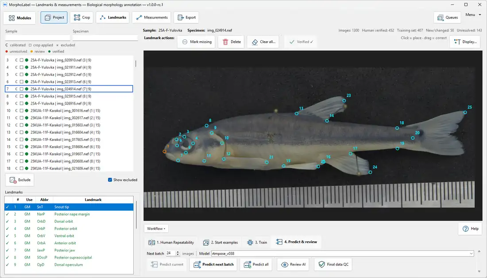
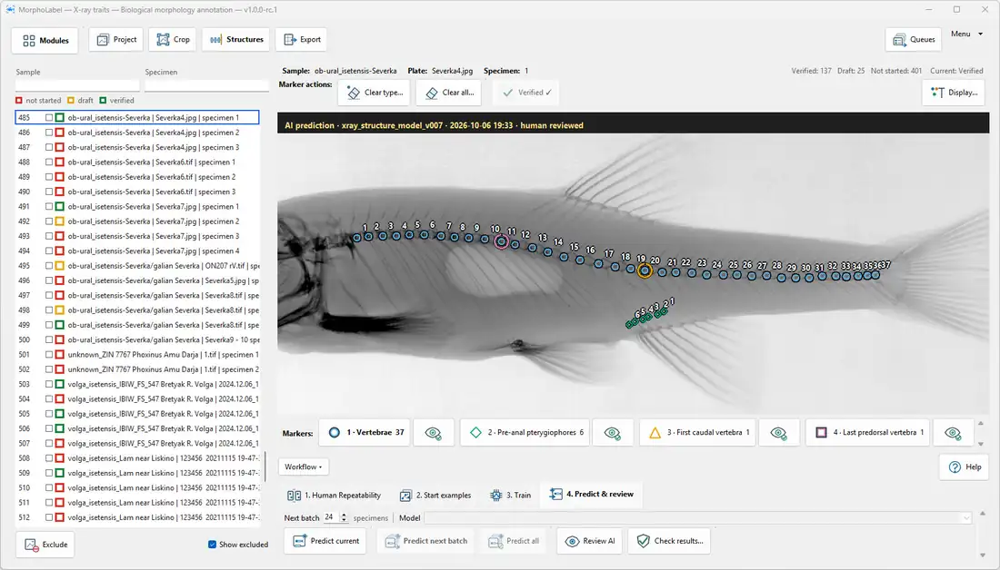

# MorphoLabel User Guide

This guide explains how to use MorphoLabel for **standardized, stage-by-stage processing of large biological image collections**: first prepare relevant images or specimen Crops, then annotate landmarks or anatomical structures across the prepared set, then review and export the resulting morphological data.

MorphoLabel has two production modules:

- **Landmarks & Measurements** — landmark-based morphology, geometric morphometrics and linear measurements.
- **X-ray Traits** — specimen Crops, anatomical structure markers and biological traits derived from radiographs.

Both modules follow the same principle:

**human reference → optional AI assistance → human verification → quality control → reproducible export**

The goal is not to remove the researcher from annotation. The goal is to make large annotation projects faster, more consistent and easier to audit.

---

## Contents

1. [What MorphoLabel is for](#1-what-morpholabel-is-for)
2. [Core concepts](#2-core-concepts)
3. [Installation and first launch](#3-installation-and-first-launch)
4. [General interface logic](#4-general-interface-logic)
5. [Landmarks & Measurements: complete workflow](#5-landmarks--measurements-complete-workflow)
6. [X-ray Traits: complete workflow](#6-x-ray-traits-complete-workflow)
7. [AI models and model management](#7-ai-models-and-model-management)
8. [Repeatability and quality control](#8-repeatability-and-quality-control)
9. [Working efficiently with large datasets](#9-working-efficiently-with-large-datasets)
10. [Data safety, provenance and backup](#10-data-safety-provenance-and-backup)
11. [Export and downstream analysis](#11-export-and-downstream-analysis)
12. [Troubleshooting and support](#12-troubleshooting-and-support)
13. [Scientific limitations and good practice](#13-scientific-limitations-and-good-practice)

---

# 1. What MorphoLabel is for

Biological imaging scales easily: a field season, museum visit, radiographic survey or automated imaging workflow can generate hundreds or thousands of images. The difficult part is often converting those images into consistent biological variables.

MorphoLabel is designed for this conversion step.

It organizes a project so that the following remain connected:

- the source image;
- the specimen or image identity;
- the annotation scheme;
- the human annotation;
- AI predictions, if used;
- the model that produced a prediction;
- later human corrections;
- verification state;
- repeatability records;
- quality-control findings;
- final exported values.

This matters because a table of final coordinates or counts is only the end product. For scientific work, it is also important to know how those values were produced and reviewed.

MorphoLabel therefore treats annotation as a workflow rather than as drawing points on images.

## 1.1 What “mass annotation” means here

Mass annotation does **not** mean blindly applying a model to all images.

In MorphoLabel it means that the repetitive parts of a large project are structured:

1. define a consistent biological scheme;
2. create a relatively small set of high-quality human examples;
3. verify them;
4. train an optional model;
5. predict new images in batches;
6. focus human effort on review and correction;
7. keep already verified work protected;
8. export a deliberately selected dataset for downstream analysis while keeping review and provenance information in the project.

This is especially useful when most new images are routine but a minority are difficult, unusual or ambiguous.

## 1.2 Process the dataset by stage

MorphoLabel is designed primarily for a **standardized workflow applied to many specimens**, not for repeatedly completing Crop → annotation → export for each individual specimen.

The usual sequence is:

1. **Define the scientific scheme once.** Decide which structures, landmarks or traits have consistent biological meaning across the collection.
2. **Prepare the collection.** Work through the relevant photographs or X-ray plates in the Crop stage, confirming specimen framing, identities and orientation. In Landmarks, skip Crop when source images are already standardized.
3. **Annotate the prepared specimens.** Move to Landmarks or X-ray Structures and work across the collection or successive batches. Use the same definitions and human-verification criteria throughout.
4. **Review and export.** Calculate measurements or traits, examine flagged cases, and export the intended reviewed subset with identity and provenance information.

**Landmarks example:** prepare Crops for the relevant photographs → place and verify the same landmark scheme across the specimens → calculate calibrated linear measurements where applicable.

**X-ray example:** confirm individual specimen Crops across all relevant radiographic plates → mark and verify vertebrae or other anatomical structures for those specimens → inspect calculated meristic traits.

The application allows returning to earlier stages when a particular image needs correction. The stage order is a recommended way to maintain consistency and avoid unnecessary context switching, **not a requirement to finish every image in the project before any later stage can be opened**. When AI is used, a small representative batch is annotated and verified first to train the model, after which prediction and review can proceed across the remaining images in that stage.

---

# 2. Core concepts

Understanding a few terms makes the whole program easier to use.

## 2.1 Project

A **project** is the persistent scientific workspace. It stores the project configuration, annotations, review state, models and other workflow information.

Use a separate project when the biological annotation scheme, source collection or scientific purpose is substantially different.

## 2.2 Source image

The **source image** is the original photograph or X-ray used as evidence.

Normal MorphoLabel annotation operations do not modify the original source image. Cropping, orientation and display transformations are stored as project information.

## 2.3 Crop

A **Crop** defines the working view of a specimen.

In the Landmarks module, Crop is optional. You can standardize specimens before landmarking or skip Crop and work directly on the source images.

In the X-ray module, a plate can contain several specimens. Each specimen receives its own Crop. Crop also records orientation.

## 2.4 Annotation

An annotation is a human- or AI-created mark associated with a biological definition.

Examples include:

- an anatomical landmark;
- a vertebral marker;
- a reference point used as a counting boundary.

Annotations are not meaningful without a scheme that defines what each point represents.

## 2.5 Prediction, draft and verified data

MorphoLabel distinguishes unfinished or machine-generated states from **human-verified** states.

A useful rule is:

**AI prediction = proposal**

**Human verification = annotation reviewed and accepted within the current project**

A **Verified** state records a human decision under the current annotation scheme. It does **not** by itself prove that the biological definition is homologous, that the image contains enough information, or that the observation is free of measurement error.

The software protects verified human annotations from routine batch prediction so that completed work is not silently replaced.

## 2.6 Annotation scheme

A scheme defines what is being annotated.

For Landmarks it contains landmark definitions and groups.

For X-rays it contains:

- repeated structures to mark and count;
- anatomical reference marks;
- biological traits calculated from those marks;
- rules relating the marks to the traits.

## 2.7 Model

A model is a trained AI component used for a particular task.

Current AI tasks include:

- Landmarks Crop;
- Landmark prediction;
- X-ray Crop/specimen detection and orientation;
- X-ray Structure annotation.

Models have identities and can be activated, compared, imported and exported.

## 2.8 Queue

A **queue** is a finite set of images or specimens that should be processed for a particular purpose.

Examples include:

- training batches;
- AI review;
- manual review;
- repeatability;
- suspicious-result review.

Queues keep review work explicit. Closing a queue leaves saved scientific data intact.

## 2.9 Repeatability

Repeatability workflows evaluate how consistently a human annotator repeats the same task.

This is different from AI accuracy and should not automatically be interpreted as a formal statistical repeatability coefficient.

For **Landmarks**, the current Human Repeatability report compares two independent annotation passes on the same images. Point displacement is expressed relative to the reference configuration span, with summaries such as median and upper error percentiles. This is a practical estimate of within-operator placement error; it is not the same as an ICC, Procrustes ANOVA or a complete analysis of all sources of measurement error.

Human repeatability is useful because even a perfect computational pipeline cannot remove ambiguity in the biological definition, specimen presentation or the underlying image.

## 2.10 Quality control

Quality control in MorphoLabel is designed to **flag records for review**, not to make biological decisions automatically.

An outlier is not necessarily an error. It may be a real biological observation.

---

# 3. Installation and first launch

## 3.1 Install MorphoLabel

MorphoLabel currently supports **Windows 10/11 x64**.

Download the current installer from the GitHub release page:

[GitHub Releases — choose the current Windows Setup-x64.exe installer](https://github.com/olegartaev/MorphoLabel/releases)

Normal users do not need to install Python, Git or AI libraries manually.

## 3.2 First launch

On first launch MorphoLabel may offer to install AI support.

Before starting the download, the setup window lists the components. AI support uses a managed runtime shared by the production modules.

You have two valid choices:

- **Install AI support** — use training and prediction.
- **Continue without AI** — use MorphoLabel manually and install AI later from **Menu → Set up AI support...**.

The AI components are several GB. The installer for the main application is much smaller because the large AI runtime is managed separately.

## 3.3 Hardware qualification

During AI setup MorphoLabel checks the available hardware, including CPU, GPU, VRAM and CUDA support, and verifies that the AI environment can perform the required work.

A compatible GPU can substantially improve training and prediction speed. The application also supports CPU fallback.

You can inspect the detected status later with:

**Menu → Hardware status…**

## 3.4 Privacy

AI setup and annotation are local operations. The AI setup process does not upload research images or project data.

---

# 4. General interface logic

MorphoLabel is organized as a module hub followed by workflow stages designed to be used **across the collection**. The interface may display one current image or specimen, but the overall task is to apply the same procedure to a large set of them.

## 4.1 Module hub

The start screen provides access to:

- **Landmarks & Measurements**
- **X-ray Traits**

Each module keeps its own scientific project state and models, while both can use the shared AI runtime.

## 4.2 Project stage

The Project stage is where you define the scientific context:

- project location;
- source images;
- annotation or trait scheme;
- measurement definitions where relevant;
- active models;
- image-preparation choices.

Set these correctly before large-scale annotation.

## 4.3 Image or specimen list

The left list is not just navigation. It communicates project state.

Depending on the module and stage, rows indicate states such as:

- not started;
- draft;
- pending review;
- verified;
- excluded.

Excluded items remain recoverable. Exclusion does not delete their scientific history.

## 4.4 Main image area

The main area is where the current image or specimen is edited.

Typical interactions include:

- zoom and pan;
- placing points;
- dragging existing points;
- deleting or clearing annotations;
- applying or verifying the current state.

## 4.5 Workflow cards

The lower workflow area groups actions by scientific sequence rather than by software implementation.

The common pattern is:

1. repeatability or training data;
2. train model;
3. predict;
4. review;
5. quality control and export.

You do not need to use AI to use the program.

## 4.6 Collection-wide stages versus per-stage batches

The main sections describe **which type of work to perform across the dataset** (Crop, Landmarks/Structures, Measurements/Traits, Export). The training and prediction cards inside a section describe **how to process a batch within that stage**.

A typical large project spends time completing and reviewing Crops across many images or plates before switching to the next type of annotation. Training batches do not require finishing the entire collection in advance: create representative human examples, train if helpful, then process and verify further batches. Revisit an earlier stage for individual corrections when needed; do not treat stage progression as an irreversible sequence.

---

# 5. Landmarks & Measurements: complete workflow

The Landmarks module is intended for standardized recording of anatomical landmark coordinates and derived distances across many specimens. The recommended stage order is **Project and scheme → Crop across the image set (optional) → Landmarks across the prepared images → Measurements and calibration → QC and Export**.

## 5.1 Create a project

Open **Landmarks & Measurements** and choose **New Project…**.

Select the project destination and the folder containing source photographs, or open an existing project if you are continuing work.

MorphoLabel indexes the source images but normal project operations do not edit them.

If the source folder later moves, reconnect it with **Change folder…**.

Use **Rescan for images** when new source images have been added. Existing project work is preserved.

## 5.2 Define the landmark scheme

A landmark scheme tells MorphoLabel what every point means.

The Project page shows the active landmark scheme and the number of landmarks.

Use **Create scheme…** or **Edit scheme…** to define the landmark set.

For a scientifically useful scheme:

- each landmark should have a reproducible anatomical definition;
- homologous points should have the same identity across specimens;
- ambiguous landmarks should be avoided or documented;
- short abbreviations should be stable because they may also be used in measurement definitions.

If a landmark cannot be observed on a particular image, use **Mark missing** rather than inventing a position.

## 5.3 Decide whether to use Crop

Under **Image preparation**, choose:

- **Use Crop** — standardize specimens before placing landmarks;
- **Skip Crop** — annotate directly on the source images.

Use Crop when specimen framing or orientation varies enough to make downstream annotation harder or less consistent.

Skip it when the images are already standardized and an extra preparation step adds no useful information.

When Crop is useful, prepare and review the relevant image collection (or a substantial working batch) in the Crop stage **before beginning mass landmark placement**. Do not assume you need to return to Crop after every individual landmark annotation.

## 5.4 Crop manually

When Crop is enabled, open the Crop stage and work through the relevant images or batches. Check consistent framing and orientation across specimens before switching to Landmarks.

The current Crop can be moved, resized and rotated.

Important controls include:

- **Apply crop** — save the current reversible Crop and remain on the image;
- **Confirm & Next** — when working inside a batch, save and continue;
- **Review AI** — inspect pending AI Crop proposals;
- **Review manual** — re-review manually created Crops;
- **Accept all AI** — accept all pending AI Crop proposals exactly as predicted.

For scientific projects, reviewing AI Crops individually is the safer default than accepting them without inspection.

## 5.5 Optional Crop AI workflow

The Crop workflow is:

### A. Create training examples

Use **Start first batch**.

The current interface suggests approximately **20–30 images** as a convenient starting Crop batch. This is a workflow default, **not a biologically or statistically validated universal minimum**. Use more examples when specimen diversity, imaging conditions, orientations or Crop difficulty are greater. Correct and confirm the selected examples by hand.

### B. Train

The **Ready** counter reports the human-confirmed examples available for training.

Choose the training parent:

- **Bootstrap / first model** for the first model;
- or an existing model as the recorded lineage parent for a later retraining step.

Press **Train**.

### C. Predict

Choose the active model and use:

- **Predict next batch**
- **Predict all**

Only eligible uncropped images are targeted. Pending proposals are kept as review states rather than repeatedly recalculated.

### D. Review

Open **Review AI** and correct proposed Crops where necessary.

Confirmed examples become part of the human reference data.

## 5.6 Place landmarks manually

After preparing the relevant Crops (or skipping Crop for already standardized images), open the Landmarks stage. Work through the specimens using the **same landmark scheme**, verifying completed annotations across the batch instead of restarting the entire workflow for each image.

Select a landmark and place it on the current specimen.

Useful controls include:

- **Mark missing** — deliberately record a landmark as unavailable;
- **Delete** — remove the selected point so it can be placed again;
- **Clear all…** — remove editable landmarks from the current image;
- **Verify image** — accept the completed landmark set after human review;
- **Display…** — adjust marker colours, size and style.

Do not verify an image until all required landmarks are either placed or explicitly marked missing.

### Interface example

*Landmarks workspace in v1.0.0-rc.1. The image area, landmark scheme, specimen list, verification state and human-in-the-loop AI workflow remain visible together so large datasets can be reviewed without separating annotation from project state.*

## 5.7 Human Repeatability

Before scaling up annotation, use **Human Repeatability…** when the project requires a quantified estimate of placement consistency.

MorphoLabel creates two independent annotation passes on the same control images.

The current interface starts with a default sample of **10 eligible images** when available. This is a practical starting size, **not a universal statistical requirement**. Increase the sample when landmark ambiguity, specimen diversity or the biological effect being studied requires a more precise estimate of measurement error.

The purpose is to estimate how much landmark position changes when the human repeats the task.

This is useful for:

- identifying poorly defined landmarks;
- estimating operator error;
- deciding whether the image quality is sufficient;
- separating annotation noise from biological variation.

Repeatability results should be interpreted in the context of the scientific question and image scale.

## 5.8 Create Landmark AI training data

The **Training data** card creates or continues a persistent training batch.

The first verified batch establishes the initial human training set. Later batches can add improvement examples.

Training examples should cover the real variation that the model will encounter, including:

- different specimen sizes;
- orientation variation;
- imaging variation;
- difficult but valid examples;
- biological variation.

Training-set **quality, diversity, sample size and similarity to the target images all matter**. Many nearly identical easy examples may add little information, but a diverse training set can still be too small. Increase the sample until performance is adequate across the biological and imaging variation that matters for the project.

## 5.9 Train a Landmark model

The **Train model** card uses the human-confirmed examples.

For the first model choose **Bootstrap / first model**.

For later training you can select a saved model as the lineage parent.

Press **Train**.

Saved models remain available under **Models…**.

## 5.10 Predict landmarks

In **Predict & review**, choose the active model.

Available actions include:

- **Predict current** — apply the active model only to the current eligible image;
- **Predict next batch** — predict the next eligible group;
- **Predict all** — predict all eligible images.

Human-verified images are protected from these routine prediction actions.

## 5.11 Review AI predictions

Use **Review AI** before verification.

The review workflow prioritizes complete, unverified AI predictions and can rank higher-risk cases first.

For each image:

1. inspect all landmarks;
2. correct misplaced points;
3. mark truly missing points as missing;
4. verify the image.

Do not use apparent model confidence as a replacement for anatomical review.

## 5.12 Final data QC

**Final data QC** is intentionally separate from pre-verification AI review.

It examines already verified data for patterns that may deserve another look, including landmark-distance, within-group measurement and shape-based checks.

A QC flag means “inspect this case”, not “delete this observation”.

If a flagged specimen is biologically real and the annotation is correct, keep it.

## 5.13 Define measurements

The Measurements stage converts landmark positions into named distances.

Open **Measurement definitions…**.

For each measurement:

- define a short code or name;
- choose the two landmarks;
- keep the definition biologically consistent across specimens.

Measurement definitions can be imported and exported as portable definitions.

## 5.14 Calibrate samples

Pixel distance becomes a physical distance only after calibration.

Use **Calibrate samples** and supply a known reference distance where physical units are required.

In the current Landmarks implementation, calibration is stored at the **sample/locality grouping level** and then applied to images in that group. This is valid only when those images share the same effective image scale. If camera distance, focal length, scanning resolution or other scale-setting conditions vary within a group, use appropriately separated groups or otherwise ensure that each applied calibration is valid for the images to which it is assigned.

Do not interpret uncalibrated pixel measurements as millimetres, and do not reuse a calibration across images whose scale is not actually the same.

## 5.15 Export landmark data

The Export stage can save landmark coordinates as:

- **TPS**
- **CSV wide**
- **CSV long**
- **MorphoJ-compatible row/column text**

You can export all landmarks or selected landmark groups.

Choose the format based on the downstream software rather than on appearance.

**Important:** direct landmark format exports do not restrict rows to **Verified only**. For a controlled analysis bundle, use **Export analysis dataset… → Verified only (default)**. The bundle includes specimen identities and reports missing or omitted records. Always confirm that the selected subset meets your scientific criteria.

MorphoLabel exports coordinates for downstream geometric morphometrics; it does not perform Generalized Procrustes Analysis or the subsequent statistical analysis of shape.

## 5.16 Export measurements

Measurements can be exported as:

- CSV;
- tab-delimited text.

The direct measurement export contains the active measurement definitions and calculated values for eligible non-excluded images; it may include unverified records, and values can be missing when landmarks or calibration are unavailable. For reviewed landmark and measurement tables together, use **Export analysis dataset… → Verified only (default)**. Calibration validity remains a separate scientific check.

---

# 6. X-ray Traits: complete workflow

The X-ray module is designed for standardized processing of radiograph collections in which a single plate may contain multiple specimens. The recommended stage order is **Project and trait scheme → Crops and specimen identities across plates → Structures across cropped specimens → calculated Traits → QC and Export**. Supported scientific outputs include counts, positions, normalized image-space distances, angles and derived traits.

## 6.1 Create an X-ray project

Open **X-ray Traits** and choose **New Project…**.

During project creation, MorphoLabel asks for the standard orientation.

Define:

- which side the head faces;
- which side the ventral side faces.

The orientation preview uses **blue for the head** and **orange for the ventral side**.

A consistent standard orientation makes later review and model training more reliable.

The trait scheme is configurable and is not hard-coded to one taxon, but the current orientation workflow assumes that **head direction and ventral side are meaningful descriptors**. The present X-ray workflow is therefore best suited to oriented specimens and ordered anatomical structures for which those concepts are appropriate.

## 6.2 Source X-rays and self-contained projects

The Project page lists the indexed source radiographs.

An X-ray project can use external source files or be made self-contained with:

**Make self-contained…**

This copies the source X-rays into the project so the project can open without the original folder.

Use **Clear reproducible cache** to remove disposable derived files without deleting source X-rays, scientific annotations or final trained models.

## 6.3 Define the trait scheme before mass annotation

Define the anatomical classes, reference markers and counting rules **before annotating large numbers of specimens**. This keeps the biological definitions stable across the radiographic series.

Open **Traits…**.

The trait editor separates three ideas.

### A. Repeated structures

These are objects that may be marked multiple times, for example vertebrae.

### B. Reference marks

These define anatomical boundaries or positions.

A reference can be:

- an independent anatomical mark;
- or a role assigned to one element in a repeated series.

### C. Biological traits

Traits are the final values calculated from annotations.

Supported trait methods are:

- **Count objects**
- **Count up to a reference**
- **Count between two references**
- **Position in a series**
- **Presence / absence**
- **Measure distance**
- **Measure angle**
- **Calculated from other traits**

For **Measure distance**, the current X-ray implementation calculates Euclidean distance in the normalized coordinate system of the oriented specimen Crop. The value is therefore an **image-space relative distance**, not millimetres or another physical unit. X-ray distance traits should not be interpreted as absolute morphometric measurements unless an appropriate calibration method is added outside the current calculation.

**Measure angle** is calculated from the annotated points in degrees.

The trait scheme therefore separates raw image annotation from the biological variable that will be exported.

This is useful when several traits are derived from the same set of annotated structures.

## 6.4 Counting rules

For boundary-based counts, the trait editor supports rules such as:

- **Before** — the boundary element is excluded;
- **Through** — the boundary element is included;
- **From** — counting starts at the boundary and includes it.

Use the preview to confirm that the rule corresponds to the biological definition before annotating a large dataset.

## 6.5 Apply the trait scheme to the project

Edits in the Traits dialog are initially a draft.

**Save trait** saves the selected trait definition inside that draft.

**Use these traits for project** applies the complete trait set to the current project.

This separation helps prevent a partially edited trait rule from silently changing ongoing work.

## 6.6 Crop specimens from X-ray plates

Open **Crops** and work through the relevant radiographic plates (manually or in AI-assisted batches) before moving to mass annotation in Structures. Each plate can contain several specimens, each requiring a consistent identity and its own confirmed Crop.

A plate may contain several specimens.

To create a specimen Crop:

1. drag on empty image space to create a frame;
2. drag the frame to move it;
3. drag a corner to resize it;
4. use the outer rotation handle to rotate it;
5. check the specimen identity;
6. check head and ventral orientation.

Useful controls include:

- **Delete** — remove only the selected Crop;
- **Clear all…** — remove all Crops from the current plate;
- **Flip ↔** — reverse head direction;
- **Flip ↕** — reverse ventral direction;
- **Apply crops** — confirm the current plate and stay on it;
- **Confirm & Next** — confirm and advance through a queue.

The source radiograph remains unchanged.

## 6.7 Specimen identity

Each Crop corresponds to a specimen identity.

The selected specimen ID can be edited. The current interface also supports **F2** for editing the selected specimen ID.

Make specimen identities stable before annotation because they link Crop, Structures and exported traits.

## 6.8 Excluding a plate

The X-ray Crop list has **Exclude / Restore**.

Plate exclusion skips the plate in active workflows without deleting its Crops or history.

Use exclusion for images that should not participate in the current analysis, not as a substitute for deleting errors.

## 6.9 Optional X-ray Crop AI

The X-ray Crop model can learn to find specimens and their orientation.

The workflow is:

1. **Start first batch** — the current interface suggests **6–10 different plates** as a practical starting batch, not as a universal minimum; use more when plate layout, specimen form, orientation or image quality are more variable;
2. correct and confirm Crops and directions;
3. **Train**;
4. choose the active model;
5. **Predict current**, **Predict next batch** or **Predict all**;
6. **Review AI**;
7. correct and confirm the proposals.

Human-reviewed plates are protected from routine prediction overwrites.

## 6.10 Annotate X-ray Structures

Once the relevant plates have confirmed specimen Crops, open **Structures** and work through the cropped specimens in sequence or batches. Mark and verify anatomical structures using the same trait scheme throughout the collection; there is no need to return to the Crop tab after every specimen unless a correction is required.

Choose a marker type and click each anatomical structure.

For repeated structures, MorphoLabel numbers points in spatial series order. The current ordering algorithm follows the **main spatial axis of the marked series**, which works well for approximately linear ordered structures such as a vertebral column in a standardized radiograph.

For strongly curved, U-shaped, circular, radial or otherwise non-linear series, the automatically inferred order may not match anatomical order. In such cases, inspect the numbering carefully before using position- or boundary-based traits.

You can:

- place markers;
- drag a marker to correct it;
- delete an individual marker;
- clear one marker category;
- clear all markers;
- adjust display colours, symbols and sizes.

The marker dock shows the current count for each structure type.

When numeric shortcuts are available, marker types can be selected with their displayed number keys.

### Interface example

*X-ray Structures workspace in v1.0.0-rc.1. Repeated structures are numbered on the specimen, reference markers remain visually distinct, and verification, AI review and result-checking controls are available in the same workflow.*

## 6.11 Reference roles and counting boundaries

Some reference points are biologically part of a repeated series.

For example, a particular vertebra can simultaneously be:

- one element of the vertebral series;
- the anatomical boundary between two count regions.

In these cases, right-click the appropriate repeated-series marker and assign its compatible reference role.

This avoids creating two different points for the same anatomical object.

Independent references are placed as their own marker type.

## 6.12 Structure visibility states

Each marker type has a visibility/status control.

Current states are:

- **Complete** — all visible instances have been marked;
- **Partial** — only some visible instances can be reliably marked;
- **Not visible** — the structure cannot be judged on this X-ray;
- **Absent** — the biological structure is truly absent.

Use these states carefully.

**Not visible** and **Absent** are scientifically different. The first describes the information in the image; the second describes the biological state.

If you change a structure to a state incompatible with existing markers, MorphoLabel asks before clearing those markers.

## 6.13 Verify a specimen

Use **Verify specimen** after checking the marker set.

Inside an annotation batch, use **Verify & Next** to verify and advance.

Verification is what turns the current marker set into accepted human-reviewed data.

## 6.14 Excluding one specimen

The Structures list has **Exclude / Restore** at specimen level.

This is different from excluding the entire X-ray plate.

Specimen exclusion:

- removes that specimen from active Structure, AI and export workflows;
- keeps the Crop, annotations and history;
- can be reversed later.

Use specimen exclusion when a particular individual is unsuitable but other individuals on the same plate are valid.

## 6.15 Human Repeatability for Structures

The Structure module can create two independent annotation passes for the same specimens.

Repeatability annotations are kept separate from the main training truth.

This is important: a repeatability exercise should measure the human process, not inflate the AI training set with duplicated annotations of the same specimen.

## 6.16 Train Structure AI

Create a verified main-annotation training batch.

The **Ready** counter reports the number of human-verified main annotations available.

The current interface uses **ImageNet ResNet18** as the initial starting point; later saved Structure models can be selected as training lineage parents.

Press **Train**.

## 6.17 Predict Structures

Choose the active Structure model, then use:

- **Predict current**
- **Predict next batch**
- **Predict all**

AI produces an editable draft.

Verified annotations are kept protected by the workflow rules.

## 6.18 Review Structure AI

Use **Review AI** to inspect saved AI drafts.

For each specimen:

1. check that every required structure is marked;
2. correct marker positions;
3. correct counts;
4. check reference roles;
5. check visibility states;
6. verify the specimen.

## 6.19 Check calculated results

Use **Check results…**.

MorphoLabel examines calculated trait values and creates a review queue for suspicious cases.

The review banner identifies the current case and why it was flagged.

A flagged value may be biologically genuine. Inspect the image and annotation rather than automatically normalizing or deleting the value.

## 6.20 Export X-ray traits

Open **Export**.

Choose:

- **All**
- **Verified only**

For a final scientific dataset, **Verified only** is generally the safer choice unless unfinished rows are intentionally required for internal checking.

The export is a CSV table containing specimen identity and the active trait columns.

---

# 7. AI models and model management

## 7.1 AI is project assistance, not ground truth

MorphoLabel treats the model as an annotation assistant.

The preferred cycle is:

1. human examples;
2. train;
3. predict;
4. review;
5. correct;
6. verify;
7. add informative corrections to later training.

This is a human-in-the-loop workflow.

## 7.2 Training data quality, coverage and sample size all matter

Training examples should represent the real range of the project.

Avoid a training set composed only of easy, nearly identical images.

Include:

- common morphology;
- unusual but valid morphology;
- imaging variation;
- difficult orientations;
- different specimen sizes;
- representative quality variation.

Do not intentionally include incorrect annotations merely to increase sample size.

## 7.3 Model lineage

When a model is trained, MorphoLabel records the selected parent or starting model.

This helps distinguish:

- a first model;
- a later improvement;
- a model imported from another compatible project.

## 7.4 Active model

The active model is the model used by prediction controls.

Always check the active model before a large **Predict all** operation.

## 7.5 Import and export

Models can be moved between projects or computers using portable model ZIP packages.

The package contains model weights and inference settings. Source research images are not included.

Only reuse a model when the target project is biologically and structurally compatible with the model’s annotation scheme.

## 7.6 When to retrain

Retraining is useful when review reveals systematic errors, for example:

- a particular body orientation;
- a new imaging setup;
- a size class absent from the first batch;
- a difficult anatomical region;
- a consistent marker-placement bias.

Randomly adding many easy examples may improve little.

---

# 8. Repeatability and quality control

## 8.1 Human repeatability answers a different question from AI accuracy

AI accuracy asks:

**How close is the model to the human reference?**

Human repeatability asks:

**How consistent is the human reference itself?**

Both matter.

If the same expert places a landmark very differently on repeated attempts, that landmark definition may not support the precision expected from the model.

## 8.2 Use repeatability early

A good time to run repeatability is before the full dataset has been annotated.

Early repeatability can reveal:

- unclear landmark definitions;
- poor image standardization;
- ambiguous boundaries;
- a need to revise the scheme.

Fixing those problems after thousands of annotations is much more expensive.

## 8.3 Quality control is a review tool

MorphoLabel quality control should not be treated as an automatic outlier-removal procedure.

A suspicious result can arise from:

- annotation error;
- image defect;
- wrong specimen identity;
- wrong Crop;
- unusual orientation;
- real biological variation.

The program helps find the case. The researcher decides what it means.

---

# 9. Working efficiently with large datasets

For large projects, the order of operations matters.

## Recommended pattern

1. Define the scheme carefully.
2. Test it on a small, diverse set.
3. Run human repeatability.
4. Fix ambiguous definitions.
5. Create a first verified training batch.
6. Train a first model.
7. Predict a moderate batch.
8. Review every prediction.
9. Identify systematic model failures.
10. Add informative corrected cases.
11. Retrain.
12. Increase batch size only after the workflow is stable.
13. Run final quality control.
14. Export verified data.

## Why not use Predict all immediately?

A model that is wrong in a systematic way can create a large amount of review work.

A moderate pilot batch reveals whether the model has learned the intended anatomy before it is applied to the whole collection.

## Use queues rather than memory

If MorphoLabel creates a review queue, work through it or close it deliberately.

Do not rely on remembering which images were “probably checked”.

Persistent review state is one of the main advantages of a project-based workflow.

## Exclude rather than delete scientific exceptions

If an image or specimen should not be analyzed, exclusion is usually preferable because it retains the record and can be reversed.

Deletion should be reserved for cases where the object itself was created by mistake and has no scientific reason to remain.

---

# 10. Data safety, provenance and backup

## 10.1 What MorphoLabel preserves

Depending on the module, the project can preserve:

- source paths and source identity information;
- Crop transformations;
- orientation;
- annotations;
- missing or visibility states;
- verification state;
- model identity;
- prediction provenance;
- repeatability sessions;
- quality-control state;
- exclusions;
- trait or measurement definitions;
- calibration;
- export-relevant workflow metadata.

## 10.2 What should be backed up

Back up:

1. the complete MorphoLabel project folder;
2. any source-image folders referenced externally.

For X-ray work, **Make self-contained…** can simplify archiving by copying the source radiographs into the project.

## 10.3 Do not use the GitHub repository as research-data storage

The public source-code repository is not the place for:

- project databases;
- unpublished images;
- private specimen records;
- credentials;
- generated diagnostic reports containing local environment information.

Keep research projects in your own selected storage and backup system.

## 10.4 Reproducible cache

Some derived files can be recreated.

The X-ray command **Clear reproducible cache** removes disposable cached material while keeping source X-rays, scientific data and final models.

---

# 11. Export and downstream analysis

MorphoLabel exports data; it does not replace statistical analysis software.

## 11.1 Landmark coordinates

Available formats include TPS, CSV and MorphoJ-compatible text.

These files are inputs to downstream analyses; exporting them does not by itself establish that every row has passed human verification. Review the project state before final analysis.

Typical downstream uses include:

- geometric morphometrics;
- Procrustes-based analyses;
- shape visualization;
- multivariate statistics.

## 11.2 Linear measurements

Exported measurement tables can be analyzed in R, Python, spreadsheets or statistical packages.

Always verify whether the measurements are calibrated to physical units before interpreting scale.

## 11.3 X-ray traits

The X-ray CSV contains the calculated trait table.

Use **Verified only** when preparing the analysis dataset after human review.

## 11.4 Landmarks analysis dataset bundle

For a reviewed collection-wide export from **Landmarks & Measurements**, use **Export → Export analysis dataset…** and leave the data scope at **Verified only (default)**. Unlike individual TPS, coordinate CSV, MorphoJ-compatible or measurement export commands, the analysis bundle is built from a consistent SQLite snapshot and includes specimen identity records, scheme/measurement definitions, coordinate and measurement tables, and missing-value or omission reports.

Use **All** only when unfinished or unchecked records are intentionally needed. The optional source-file SHA256 check can verify source-file identity, but checking a hash does not establish biological correctness. Verify that the selected dataset and calibration match the scientific analysis.

## 11.5 Keep the project after publication

Do not treat the export as the only valuable output.

The project contains the provenance needed to revisit an annotation, inspect a model prediction or reproduce the export.

---

# 12. Troubleshooting and support

## 12.1 AI was skipped on first launch

Open:

**Menu → Set up AI support...**

You can install it later without recreating the project.

## 12.2 AI setup failed

Retry the guided setup.

Partial downloads are kept locally and can resume.

If the problem repeats, create a diagnostic report.

## 12.3 Create a diagnostic report

Open:

**Menu → Create diagnostic report…**

MorphoLabel creates a diagnostic ZIP and provides controls to open its folder or copy its path.

The diagnostic ZIP is designed not to include:

- research photographs;
- the project SQLite database.

Attach the ZIP when reporting a reproducible technical problem.

## 12.4 An image should not be analyzed

Use **Exclude** rather than deleting scientific work.

Restore it later if needed.

In X-ray projects, remember that there are two exclusion levels:

- plate exclusion in Crops;
- individual specimen exclusion in Structures.

## 12.5 AI prediction looks wrong

Do not verify it.

Correct the annotation manually, then verify the corrected state.

If the same failure repeats across many images, add representative corrected cases to the training data and retrain.

## 12.6 A quality-control result is biologically plausible

Keep it if the source image and annotation are correct.

Quality control is a review trigger, not a rule that the specimen must be removed.

## 12.7 The source folder moved

For the Landmarks module, use the project’s source-folder relinking controls rather than rebuilding the project.

For X-ray projects, consider making the project self-contained before moving it between computers.

## 12.8 Need to move a trained model

Use the model import/export controls rather than copying internal runtime folders manually.

## 12.9 Getting help from an AI assistant

Open **Menu → Help with an AI assistant…** to copy a ready-made prompt for an external AI assistant or to open the public User Guide.

The prompt points to the User Guide and source code so the assistant can check MorphoLabel's actual features and explain steps for a non-programmer. Paste the prompt into an AI assistant of your choice, then add your question.

MorphoLabel does not connect to an external assistant or automatically share images, project data, scientific results or logs. AI answers can be wrong: verify scientific decisions and avoid sharing confidential research data.

---

# 13. Scientific limitations and good practice

MorphoLabel can make annotation faster and more traceable, but it cannot solve a poorly defined biological problem.

## 13.1 The software cannot define homology for you

A landmark is useful only if the same biological structure is identified consistently across specimens.

A model can reproduce a definition. It cannot establish whether that definition is biologically homologous.

## 13.2 AI performance depends on reference quality and data match

Inconsistent or biologically ambiguous training annotations can introduce inconsistency or bias into the model. Performance also depends on training-set size, coverage of biological and imaging variation, and how similar the target images are to the training data.

Automation can be highly consistent under suitable conditions, but consistency is not the same as biological validity. Validate model output against an appropriate human reference and against the precision required by the scientific question.

For this reason, repeatability and review are part of validating the measurement process in high-precision studies.

## 13.3 Image quality sets an upper limit

If a structure cannot be resolved in the source image, the appropriate project state may be **missing**, **partial** or **not visible**, depending on the module and trait definition, rather than a guessed coordinate or marker.

## 13.4 Avoid silent scheme drift

Do not change landmark or trait definitions halfway through a project without documenting and validating the change.

A definition that changes meaning produces a dataset that may look numerically complete but is biologically inconsistent.

## 13.5 Preserve the final project and software version

For reproducibility, retain:

- the project;
- the source images;
- the exported data;
- the active scheme;
- the trained model when AI contributed;
- the MorphoLabel version used.

---

## Support and citation

Repository: https://github.com/olegartaev/MorphoLabel

Questions: **morpholabel@olegartaev.com**

Citation metadata: [CITATION.cff](../CITATION.cff)

License: [Apache License 2.0](../LICENSE)
